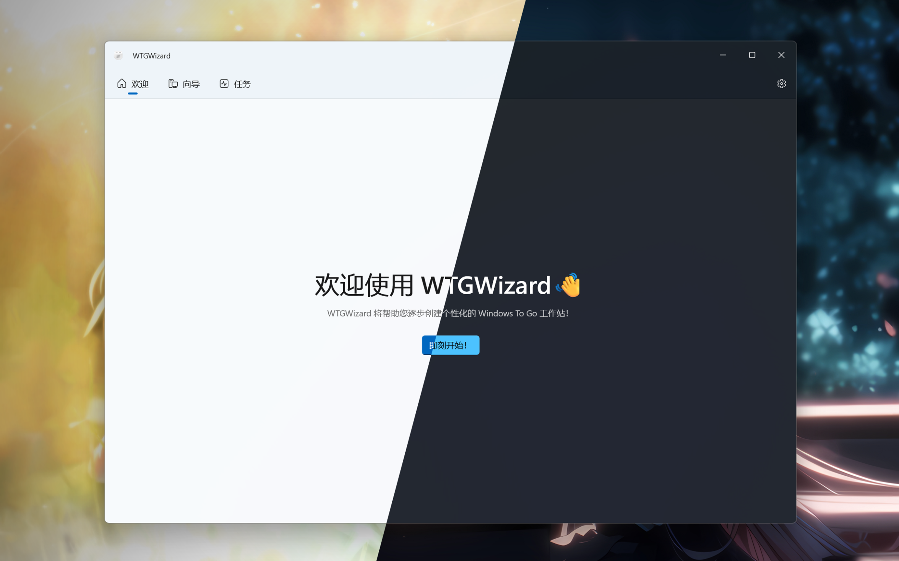

# WTGWizard

<p align="center">
  
</p>

<p align="center">
  一个基于 <strong>WinUI</strong> 开发的现代化 <strong>Windows To Go</strong> 部署工具
</p>

---



## 功能特性

- **五步引导向导** — 程序将逐步引导您完成映像选择、磁盘配置、调整部署设置与高级设置，最后提供摘要页供您确认全部部署配置。
- **WIM / ESD 映像支持** — WTGWizard 同时支持 wim 与 esd 两种格式的 Windows 映像。
- **两种安装方式** — WTGWizard 提供全新安装与分区安装两种方式：前者将清空并重建所选磁盘的分区布局；后者允许您将 Windows 安装到已有分区中。
- **驱动集成** — 将您所需的驱动程序集成到 Windows 中。
- **应答文件处理** — 使用您自己的应答文件来自定义 Windows 安装。
- **部署仪表板** — 简洁而强大的任务页面，可跟踪部署进度，并内置磁盘性能监视器以展示磁盘性能指标。
- **本地化** — WTGWizard 目前支持英语与简体中文。

## 使用要求

- 系统：Windows 10 1809（Build 17763）或更高版本，**x64**。在 **Windows 11** 上使用以获得最佳体验。
- 运行时: 
  - 对于 `-SCD` 版本: 包含了所有必要运行时，你不需要额外安装任何运行时或框架。
  - 对于 `-FDD` 版本: 需要提前安装[.NET 10.0 Desktop Runtime x64](https://dotnet.microsoft.com/download/dotnet/thank-you/runtime-desktop-10.0.10-windows-x64-installer?cid=getdotnetcore) 和 [Windows App SDK 2.4.0 x64](https://learn.microsoft.com/windows/apps/windows-app-sdk/downloads) 
- **管理员权限**：应用会请求获取管理员权限以便进行磁盘操作、DISM 等。
- 需要一个外接硬盘或 USB 驱动器。

## 限制

- WTGWizard **不支持**创建使用 MBR（主引导记录）磁盘格式的 Windows To Go 驱动器（尽管技术上可行）。WTGWizard 只支持在 GPT 磁盘格式上创建 Windows To Go。
- WTGWizard **不支持**创建使用 Legacy 引导方式的 Windows To Go 驱动器（尽管技术上可行）。WTGWizard 只支持创建使用 UEFI 引导方式的 Windows To Go。

## 下载与使用

1. 从 [Releases](../../../releases) 页面下载 `WTGWizard-vX.Y.Z-x64-FDD.zip`或者`WTGWizard-vX.Y.Z-x64-SCD.zip`。
2. 在启动前安装必要的运行库，详见[使用要求](#使用要求)
3. 解压并运行 `WTGWizard.Main.exe`。程序将请求获取**管理员权限**。
4. 按向导完成每个设置页面，确认配置后开始部署。部署时长受磁盘性能影响，可能需要一定时间。

> **警告**：部署会擦除目标磁盘或分区。开始前请仔细核对您的选择。

## 从源码构建

要求：

- [.NET 10 SDK x64](https://dotnet.microsoft.com/download/dotnet/thank-you/sdk-10.0.400-windows-x64-installer)（由 `global.json` 锁定为 `10.0.400`）
- Windows ADK 10.0.26100（随 Visual Studio 2022 附带，或单独安装 Windows ADK）

```powershell
dotnet build WTGWizard.slnx
```

发布发布版构建：

```powershell
./BuildArtifacts.ps1 -BuildType FDD -MainVer 1.0.0 -WorkerVer 1.0.0 -ZipTag v1.0.0
./BuildArtifacts.ps1 -BuildType SCD -MainVer 1.0.0 -WorkerVer 1.0.0 -ZipTag v1.0.0
```

或直接使用 PublishProfile（发布参数唯一来源为 `Properties/PublishProfiles/*.pubxml`）：

```powershell
dotnet publish src/WTGWizard.Main -p:PublishProfile=SCD-x64
dotnet publish src/WTGWizard.Main -p:PublishProfile=FDD-x64 -p:PublishDir=build\publish\FDD
```

## 架构

WTGWizard 分为 **Main** 进程（WinUI 3 界面）与**独立 Worker** 子进程，二者通过**命名管道 IPC** 协议通信。

```
src/
├── WTGWizard.Main/                    # WinUI 3 应用（界面、ViewModel、页面）
├── WTGWizard.Main.DeploymentCore/     # 部署引擎（7 步流水线、编排器）
├── WTGWizard.Main.Language/           # 本地化资源
├── WTGWizard.Shared.Services/         # 磁盘 I/O、WIM、日志
├── WTGWizard.Shared.Common/           # 命名管道 IPC 协议
└── WTGWizard.Worker/                  # 独立 Worker（处理部署任务）
```

**部署流水线**：创建磁盘布局/格式化分区 → 释放映像 → 集成驱动 → 导入应答文件 → 应用系统设置 → 创建引导文件 → 最终清理。

编排器通过可观察流发布任务更新；界面渲染任务卡片与终端输出，与 Worker 进程解耦。

## 版本与发布

- 推送 `v*` 形式的 Tag 触发 GitHub Actions 发布工作流。
- 包含 `preview` 字样的 Tag（如 `v1.0.0-preview1`）将作为**预发布（Pre-release）**发布。
- **Main** 版本随 Release Tag 更新；**Worker** 版本独立维护。
- 产品版本自动附带完整的 40 位提交哈希（如 `1.0.0+<hash>`）。

## 本地化

本地化字符串存放于 `.resx` 文件（`Lang.resx` 为英语，`Lang.zh-CN.resx` 为简体中文），键名以点号分隔，并通过强类型设计器类对外暴露。

## 许可协议

本项目基于 **GNU 通用公共许可证 v3.0** 授权。请在 GNU GPLv3 条款下使用。参见 [LICENSE](../LICENSE)。

第三方组件许可清单见 [THIRD-PARTY-NOTICES](../THIRD-PARTY-NOTICES)。

## 商标

WTGWizard 是**独立的开源项目**，与 Microsoft 无关联、未获其背书或赞助。
**_Windows_**、**_Microsoft_**、**_Windows To Go_** 以及 Windows 徽标均为 Microsoft Corporation 的商标或注册商标。
应用程序图标包含对 Windows 徽标的概念性重新着色演绎，仅用于标识用途。

## 致谢

WTGWizard 使用/参考了以下项目。感谢它们的出色工作！

- [wimlib](https://wimlib.net) / [ManagedWimLib](https://github.com/MircoBabin/ManagedWimLib) — WIM 相关操作，WTGWizard 的核心组件。
- [Vanara](https://github.com/dahall/Vanara) — DiskIOService 实现的坚实基础。
- [Windows CommunityToolkit](https://github.com/CommunityToolkit) — MVVM 与 WinUI 控件。
- [Serilog](https://serilog.net) — 应用日志服务。
- [Starward](https://github.com/Scighost/Starward) — 单解决方案多项目架构与本地化实现。Starward 是一款美观易用的米哈游游戏启动器，附带丰富的增强功能。
- [TaskMonitor](https://github.com/linesoft2/TaskMonitor) — 磁盘性能监视器平均响应时间的计算公式。TaskMonitor 是一款年轻但功能强大的系统性能监视器，让你可以在任务栏中监视系统性能。

## 免责声明

请**自行承担使用风险**。WTGWizard 会执行破坏性的磁盘操作，作者不对任何意外的数据丢失或损坏负责。


